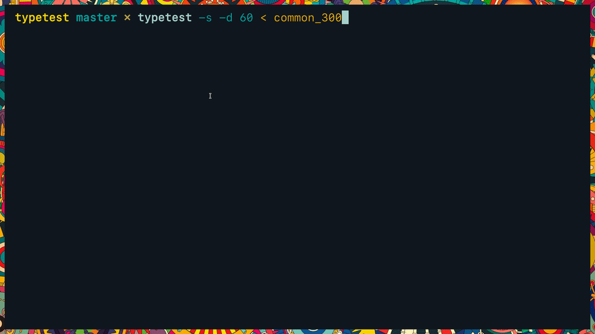

### test your typing speed without leaving the terminal



This repo is home to two different programs, one is a minimal requirements self contained file `tt.py` and the other is `typetest` with extensible features.
As is both are a near clone of [10fastfingers](https://10fastfingers.com/typing-test/english) with an added bonus of being able to see typing speed as you're typing.
They share the looks but not the wits.

Differences in the way typing speed is calculated and feedback accross platforms got me interested in writing my own program for testing typing speed.
I've come to love how simple and unrestrictive [10fastfingers](https://10fastfingers.com/typing-test/english) is compared to [typingclub](https://www.typingclub.com/) and [typeracer](https://www.typeracer.com).
They all have great advantages for varying purposes but when it comes to warming up or just waiting for a compile of some program to finish I am yet to find a rival to [10fastfingers](https://10fastfingers.com/typing-test/english).
That is why I decided to clone its functionality and add some of the features I love from other sites.

# tt.py
`tt.py` is a self contained minimal typing test program written with [blessed](https://github.com/jquast/blessed/).
It calculates typing speed as sum of spaces and characters from correctly written words divided by test duration.
Adjustable settings are `DURATION` and `NUMBER_OF_ROWS`, which are set within the file itself for now.
The input text is to be piped into the program like so: `cat typetest/tests/english/basic | python tt.py` or `python tt.py < typetest/tests/english/basic` or `python wiki.py | python tt.py`, the latter finds a [featured article](https://en.wikipedia.org/wiki/Wikipedia:Featured_articles) on wikipedia.

# typetest
Typetest is a full fledged extensible program providing multiple ways of calculating, showing and storing typing speed.
Gui is written with [curses](https://docs.python.org/3/howto/curses.html), cli with [docopt](https://github.com/docopt/docopt).

### TODO
- cli
  - implement options (-abd --cpm...)
  - '#' in usage means not implemented
- gui
  - handle ctrl keypresses manually
- logic
  - per letter typing speed
  - per letter accuracy
  - per word typing speed
  - per word accuracy
  - 5 seconds sustained max speed
  - 10 seconds sustained max speed
  - common misspelling
  - two letter mixups e.g. word -> wrod
  - add some vi commands (c-w, c-u)
  - command (c-r) to restart test

### Usage
```
Usage:
    cli.py  [-abehpsw] [-v | -q] [-d=<duration>] [-l=<layout>]
            [--delimiters=<string>] [-r=<directory> | -f=<file>]
            [-o=<file>] [--output-format=<format>]
            [--bg=<color> --fg=<color> --cc=<color> --wc=<color>]
    cli.py  (--help | --version)


Options:
    -a --all-correct-chars      Consider correct characters from both
                                correct and wrong words. #
    -b --beep                   Alert the user when he makes a mistake. #
    --bg=<color>                Terminal background color. [default: 0]
    --cc=<color>                Correct color. [default: 46]
    --cpm                       Show characters per minute. #
    -d --duration=<duration>    Limit duration of the typing test to
                                <duration>. #
    --delimiters=<string>       Delimiters to divide text file by.
                                Decoded with utf-8. [default: \\n ]
    --dph                       Show depressions per hour. #
    -e --endless                Repeat test endlessly, if -r is
                                specified randomizes every repetition. #
    -f --file=<file>            File to read the test from.
                                Overrides --root-dir option.
    --fg=<color>                Foreground main color. [default: 7]
    -h --hide                   Hide timer and dynamic wpm counter.
    --help                      Show this screen.
    -l --layout=<layout>        Keyboard layout for calculating
                                keystrokes. [default: qwerty] #
    -n --normalize              Use keystrokes over characters. #
    -o --output=<file>          File to store output result in.
    --output-format=<format>    File format to store output as; json,
                                csv. [default: json] #
    -p --prevent-wrong          Accept up to 4 correct chars in a row,
                                then block incorrect input. If -w is
                                set accept only correct words. #
    -q --quiet                  Print no results.
    -r --root-dir=<directory>   Root directory to randomize the test
                                from. [default: typetest/tests/english/]
    -s --shuffle-words          Shuffle words.
    -v --verbose                Show a more extensive result.
    --version                   Show version.
    -w --word-by-word           Evaluate word by word instead of
                                character by character. #
    --wc=<color>                Wrong color. [default: 196]

Shortcuts:
    ^C / Ctrl+c                 End the test and get results now.
    ^H / Ctrl+h                 Backspace.
    ^R / Ctrl+r                 Restart the same test. #
    ^W / Ctrl+w                 Delete a word. #
```
