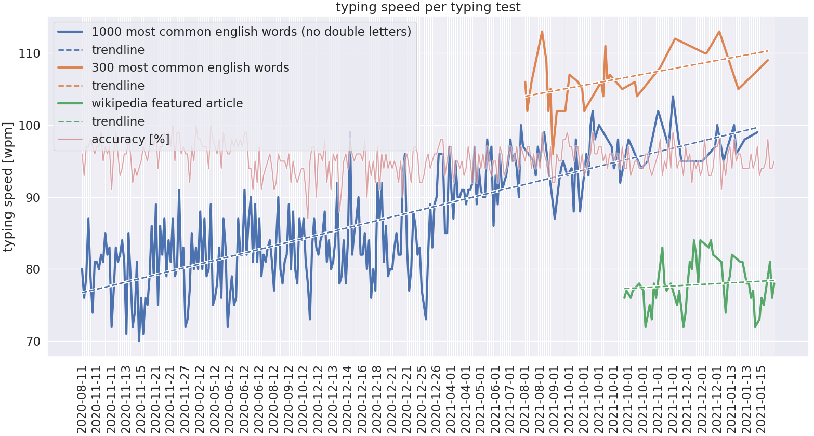
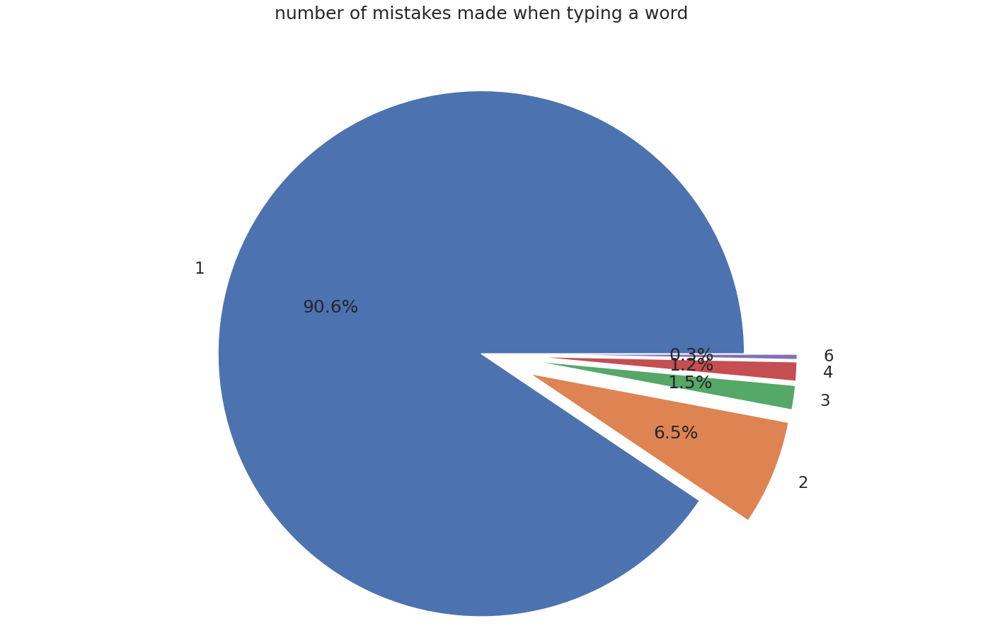
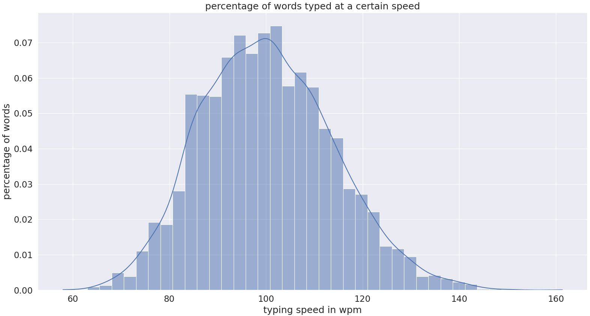

# test your typing speed


## analyse your results

```
You can find the rest of the charts at the bottom of this file.
```

## inception of the idea
This repository is home to a self-contained file `typetest`.
As is it is a near clone of [10fastfingers](https://10fastfingers.com/typing-test/english) with an added bonus of being able to see typing speed as you're typing.

Differences in the way typing speed is calculated and feedback across platforms got me interested in writing my own program for testing typing speed.
I've come to love how simple and unrestrictive [10fastfingers](https://10fastfingers.com/typing-test/english) and [keybr](https://keybr.com) feel compared to [typingclub](https://www.typingclub.com/) and [typeracer](https://www.typeracer.com).
They all have great advantages for varying purposes but when it comes to warming up or just waiting for some program to compile (*have you tried [compiling chromium](https://www.reddit.com/r/archlinux/comments/gdeiui/ungoogledchromium_taking_a_long_time_to_build/)?*) I am yet to find a rival to [10fastfingers](https://10fastfingers.com/typing-test/english).
That is why I decided to clone its functionality and add some features I love from other sites.

## typetest
`typetest` is a self-contained minimal typing test program written with [blessed](https://github.com/jquast/blessed/).
It calculates typing speed as sum of spaces and characters from **correctly written words** divided by test duration.
Adjustable settings are `duration`, `input`, `output`, `rows` and `shuffle`, which can be set using the command arguments.
The results of `typetest` by default go into a file aptly named `results` positioned in the same directory as `typetest`.

## ideas for tests
Along with `typetest` this repository features sample tests.
Try them like so: `typetest -s -d 60 -i common_200` or scrape something of the internet, like a [featured article](https://en.wikipedia.org/wiki/Wikipedia:Featured_articles) on wikipedia.

```python
#!/usr/bin/env python3
import re
import requests
from bs4 import BeautifulSoup

word_pattern = re.compile(r"['A-Za-z\d\-]+[,\.\?\!]?")  # symbols to keep
url = 'https://en.wikipedia.org/wiki/Special:RandomInCategory/Featured_articles'

r = requests.get(url)
soup = BeautifulSoup(r.text, 'html.parser')
for sup in soup.select('sup'):
    sup.extract()  # remove citations

text = ' '.join(p.text for p in soup.select('p'))
text = re.sub(r'\[.*?\]|\(.*?\)', '', text)  # remove parenthesis
print(' '.join(re.findall(word_pattern, text)))
```
If you create a file called `wiki_random` you can start the test with `wiki_random | typetest`.
Write your own scraper, you may find some suggestions [here](https://en.wikipedia.org/wiki/Lists_of_English_words).

## usage

```
usage: typetest [-h] [-d DURATION] [-i INPUT] [-o OUTPUT] [-s] [-r ROWS]

optional arguments:
  -h, --help            show this help message and exit
  -d DURATION, --duration DURATION
                        duration in seconds (default: inf)
  -i INPUT, --input INPUT
                        file to read words from (default: sys.stdin)
  -o OUTPUT, --output OUTPUT
                        file to store results in
                        (default: /home/medo/repos/typetest/results)
  -s, --shuffle         shuffle words (default: False)
  -r ROWS, --rows ROWS  number of test rows to show (default: 2)

example:
  typetest -i test.txt -s -d 60
  echo 'The typing seems really strong today.' | typetest -d 3.5
  typetest < test.txt

shortcuts:
  ^c / ctrl+c           end the test and get results now
  ^h / ctrl+h           backspace
  ^r / ctrl+r           restart the same test
  ^w / ctrl+w           delete a word
  ^u / ctrl+u           delete a word
```

## installation

### \*nix

1. install python 3
2. install [blessed](https://pypi.org/project/blessed/)
3. clone this repository
4. run `python typetest -s -d 60 < common_300`
5. (optional) add `typetest` to path or make an alias like `tt`
6. (optional) store your results in some file and analyse

### windows

caveats:
1. Redirecting or piping test words into the program isn't tested yet (`typetest -i input.txt` should work as intended).

A way to completely avoid the aforementioned caveats is to use a [linux subsystem (WSL)](https://docs.microsoft.com/en-us/windows/wsl/about), installation details can be found [here](https://docs.microsoft.com/en-us/windows/wsl/install-win10).
The rest of the installation steps are the same as for \*nix.

## notes

- [A Note on Calculating Text Entry Speed](https://www.yorku.ca/mack/RN-TextEntrySpeed.html)

## charts





## todo
- adjust wpm diagram to show linear timeline
